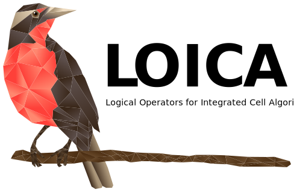

============
Introduction
============

Welcome to the LOICA (Logical Operators for Integrated Cell Algorithms) repository, our Python package for designing, modeling and characterizing genetic networks.

As you may have noticed, our logo features a beautiful bird—loica `(Leistes loyca) <https://en.wikipedia.org/wiki/Long-tailed_meadowlark>`_; a bird native to Chile known for its particular red chest and legendary kindness, with which we share name.

============
Installation
============

Installing LOICA is way easier than pronuncing it!

.. code:: python

   pip install loica
   
For more details please refer to our `Wiki <https://github.com/RudgeLab/LOICA/wiki>`_ for installation instructions and developer guides.

====================
LOICA allows you to:
====================

- Compile Code into DNA fragments that execute Cell Algorithms
- Easy programation of genetic network models
- Generation of synthetic data
- Communicate with Flapjack
- Use and output SBOL files
- Use all sorts of cellular computation
- Easy, fluid and customisable DNA design

=========
Tutorials
=========

Now that you have LOICA installed you can familiarize yourself with the tool using the `Jupyter notebook <https://github.com/RudgeLab/LOICA/tree/master/notebooks>`_ tutorials designed for this purpose.
